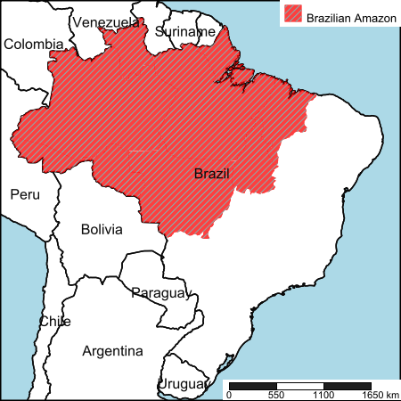
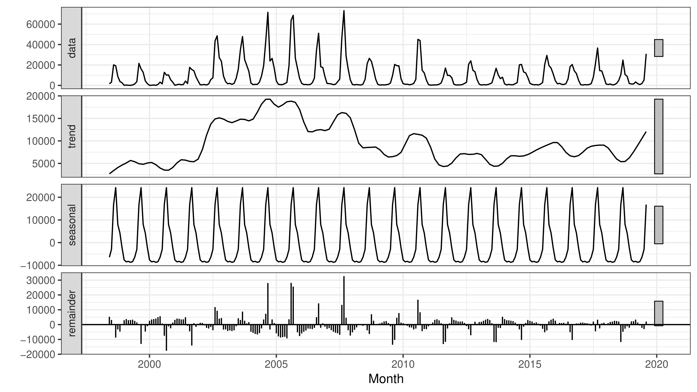
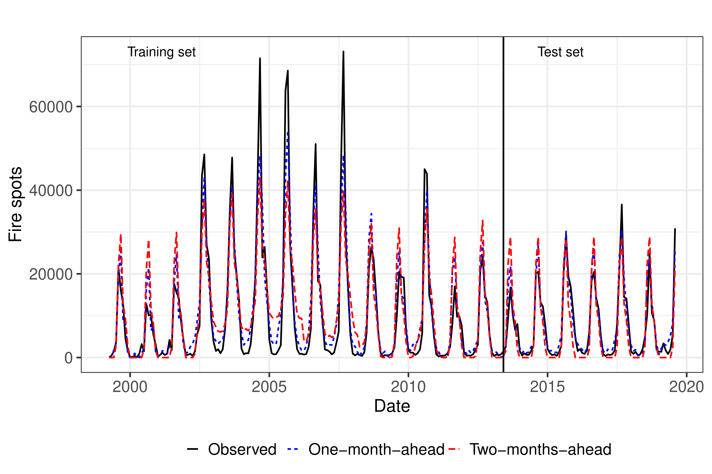

# Publication in  [28th European Symposium on Artificial Neural Networks, Computational Intelligence and Machine Learning (2020 ESANN)](https://www.esann.org)
## (Rejected) :deciduous_tree::fire::deciduous_tree: Short-term forecasting of Amazon rainforest fires based on ensemble decomposition model

[</img> Ramon Gomes da Silva](https://orcid.org/0000-0001-8580-7695), [</img> Matheus H. D. M. Ribeiro](https://orcid.org/0000-0001-7387-9077), [</img> Viviana Cocco Mariani](https://orcid.org/0000-0003-2490-4568), [</img> Leandro dos Santos Coelho](https://orcid.org/0000-0001-5728-943X)


Brazilian Amazon rainforest map
:---------:


Signal decomposition
:-----:


Fire spots prediction
:-----:


### Code
- [Fire repository file](Fire)

### Publication
- Preprint ([arXiv](http://arxiv.org/abs/2007.07979) | [ResearchGate](https://www.researchgate.net/publication/343001754_Short-term_forecasting_of_Amazon_rainforest_fires_based_on_ensemble_decomposition_model))

### How to cite this paper
```bibtex
@misc{silva2020shortterm,
    title={Short-term forecasting of Amazon rainforest fires based on ensemble decomposition model},
    author={Ramon Gomes da Silva and Matheus Henrique Dal Molin Ribeiro and Viviana Cocco Mariani and Leandro dos Santos Coelho},
    year={2020},
    eprint={2007.07979},
    archivePrefix={arXiv},
    primaryClass={cs.LG}
}
```
